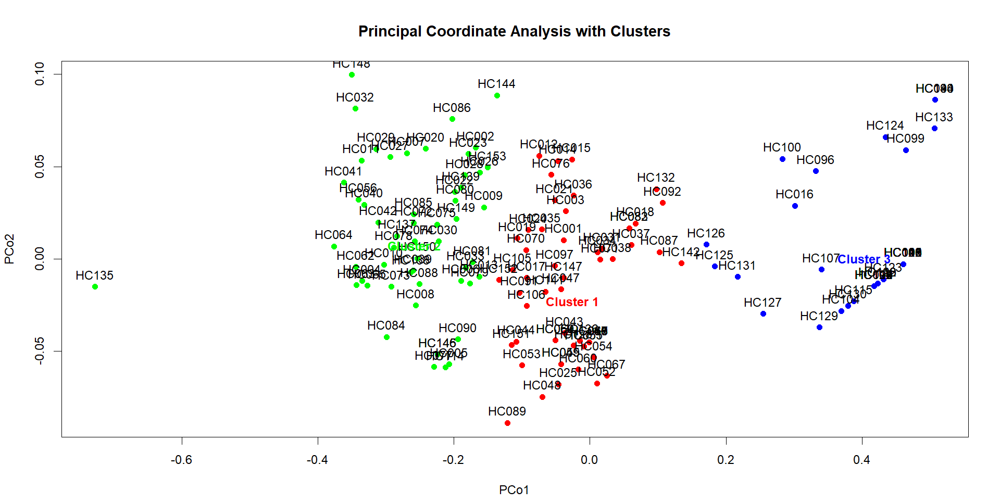
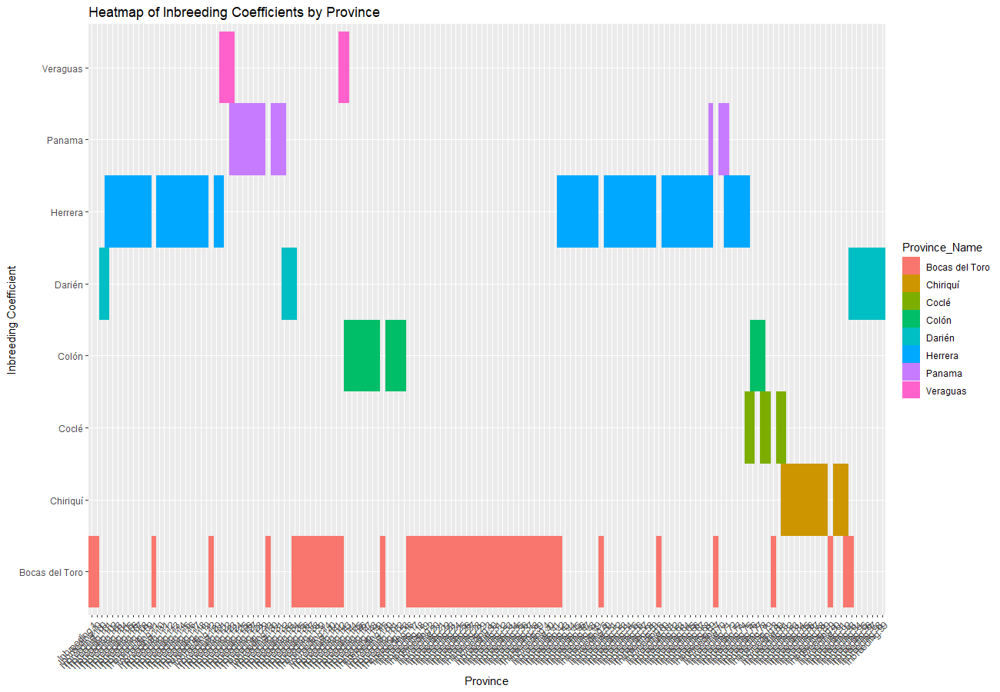

# **Genetic Marker Data Analysis**

This guide outlines the steps for analyzing genetic marker data, calculating key descriptive statistics, and performing visualization and clustering.

## **1. Setting the Working Directory and Loading Data**

Begin by setting the working directory and loading the required data file in `.xlsx` format. The genetic data will be extracted starting from column 6 to the last column, assuming the first five columns contain metadata such as accessions and provinces.

## **2. Calculating Descriptive Statistics**

A series of calculations will be performed on the genetic data, including:

- **Shannon's Information Index (I):** A diversity measure that calculates the uncertainty in predicting a random genetic marker.
- **Observed Heterozygosity:** The proportion of individuals that are heterozygous for a given genetic marker.
- **Expected Heterozygosity:** A measure of the genetic variation that is expected in a population under Hardy-Weinberg equilibrium.
- **Minor Allele Frequency (MAF):** The frequency of the less common allele in the population.
- **Fixation Index (Fst):** Measures genetic differentiation between populations.
- **Inbreeding Coefficient:** An estimate of inbreeding, calculated using observed heterozygosity.

The results will be compiled into a data frame and saved as a CSV file.

## **3. Principal Coordinate Analysis (PCoA) and Clustering**

### **Step 1: PCoA**
Principal Coordinate Analysis (PCoA) will be performed using the Euclidean distance matrix of the calculated statistics. This allows visualization of the genetic relationships among accessions.

### **Step 2: Hierarchical Clustering**
Hierarchical clustering will be applied using the Ward.D2 method to group similar accessions. The tree will be cut into clusters for further analysis.

### **Step 3: Visualization**
A dendrogram will be generated to visualize the clustering, and the PCoA plot will be enhanced by adding clusters. Clusters will be highlighted by encircling the groups, and centroid labels will be added.

## **4. Heatmap and Scatter Plot Matrix**

### **Step 1: Heatmap**
A heatmap will be created to visualize the distribution of key genetic statistics (e.g., Shannon Information, Heterozygosity, MAF, etc.) across accessions. This provides an overview of genetic diversity.

### **Step 2: Scatter Plot Matrix**
A scatterplot matrix will be generated for selected variables such as Shannon Information, Heterozygosity, and MAF. The plots will be colored based on cluster assignments.

## **5. Province-wise Data Analysis**

For further exploration, the data is divided based on the geographic regions (provinces). Summary statistics are computed for each province, and visualizations include:

- **Boxplot:** To show the distribution of Shannon Information by province.
- **Scatter Plot:** To compare observed vs. expected heterozygosity across provinces.

## **6. Circle Cluster Tree for Provinces**

A circle cluster tree (chord diagram) will be created to visualize the hierarchical structure of provinces based on genetic statistics.

## **7. Density Plot for Fixation Index by Province**

Density plots will be generated to compare the distribution of the fixation index across different provinces, highlighting regions with higher genetic differentiation.

## **8. Inbreeding Coefficient Analysis**

A detailed analysis of the inbreeding coefficients is conducted. The data is reshaped into a long format for further visualization, including:

- **Stacked Bar Plot:** To display the count of accessions across provinces grouped by inbreeding coefficients.
- **Heatmap:** To visualize the inbreeding coefficients across provinces.

## **License**

This project is licensed under the MIT License.
